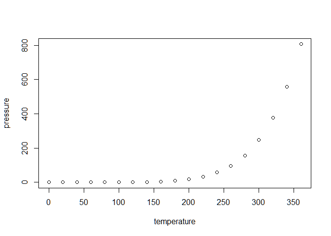

<!--
**Make sure you're editing README.Rmd, *not* README.md!!**
(README.md is generated from README.Rmd.)
&#10;After changing this file, run `devtools::build_readme()`!!
-->

# datey 

<!-- badges: start -->

<!-- badges: end -->

The **datey** package provides a standard mapping of dates onto an
annual grid.

This matters in contexts where the primary unit is years and where
definitions need to be precise.

Classic examples are mortality experience analysis and the valuation of
life assurance and annuities. Mortality rates are defined *per annum*
but experience and valuation data is usually defined using dates
(i.e. days).

The benefits of using **datey** are:

1.  A consistent framework for converting dates to and from a uniform
    annual grid.

2.  Handling the often-overlooked issue of whether a date means the
    start, during or end of a day.

3.  Fixed precision arithmetic, which excludes bugs relating to floating
    point arithmetic[^1].

PUT THIS FIRST: Long story short: If you are working primarily with
annual rates in the annual domain but your data specifies time using
dates, then it is worth considering using **datey**.

See

- surv package author’s comments
  [here](https://cran.r-project.org/web/packages/survival/vignettes/tiedtimes.pdf).
  Note that they use days to avoid this issue.

- See [CRAN FAQ
  7.31](https://cran.r-project.org/doc/FAQ/R-FAQ.html#Why-doesn_0027t-R-think-these-numbers-are-equal_003f)

## Installation

You can install the development version of datey from
[GitHub](https://github.com/) with:

``` r
# install.packages("pak")
pak::pak("logmu-org/r-datey")
```

## Example

This is a basic example which shows you how to solve a common problem:

``` r
library(datey)
## basic example code
```

<!--
&#10;What is special about using `README.Rmd` instead of just `README.md`? You can include R chunks like so:
&#10;
``` r
summary(cars)
#>      speed           dist       
#>  Min.   : 4.0   Min.   :  2.00  
#>  1st Qu.:12.0   1st Qu.: 26.00  
#>  Median :15.0   Median : 36.00  
#>  Mean   :15.4   Mean   : 42.98  
#>  3rd Qu.:19.0   3rd Qu.: 56.00  
#>  Max.   :25.0   Max.   :120.00
```
&#10;You'll still need to render `README.Rmd` regularly, to keep `README.md` up-to-date. `devtools::build_readme()` is handy for this.
&#10;You can also embed plots in the man/figures folder, for example:
&#10;
&#10;In that case, don't forget to commit and push the resulting figure files, so they display on GitHub and CRAN.
-->

[^1]: Specifically, the
    [non-associativity](https://en.wikipedia.org/wiki/Associative_property#Nonassociativity_of_floating-point_calculation)
    of floating point arithmetic.
